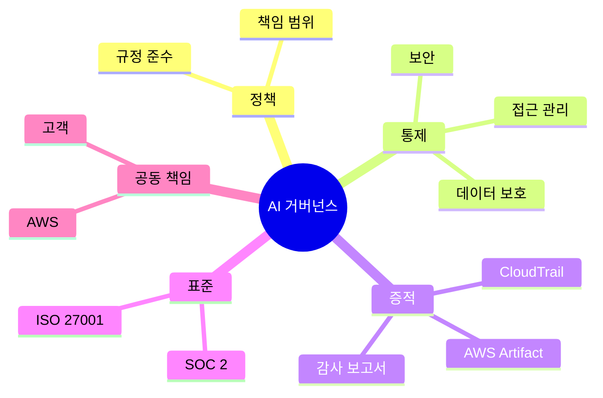

# AIF-C01 Task 5.2 Part 1 - 거버넌스·규정 준수 규제 인식 / 규정 준수 표준·감사·공동 책임·Artifact·SOC 2·ISO 27001·고객 규정 준수 센터

> AI 시스템 거버넌스/규정 준수 규제, 6개 강의 중 1번째

## 1. 규정 준수 표준 필요성

- AI 위험 염려 AI 워크로드 몇 가지 규정 준수 표준 개발됨
- 표준 따르면 비즈니스/고객 보호 + 의사결정 공정성 보장 도움
- 회사 속한 업종 따라 해당 **산업별 표준 준수 필요** 가능
- **정기 감사/검사 통해 회사 표준 충족 확인**

## 2. 공동 책임 모델 - 규정 준수에도 적용

- 보안/규정 준수 AWS 고객 공동 책임, 공동 책임 모델 설명 위해 생성
- **보안과 규정 준수 모두 적용**
- **AWS 책임:** 기본 물리 데이터 센터/인프라 보호해 클라우드 규정 준수 요구 충족 책임
- **고객 책임:** 규정 준수 요구 충족 위해 클라우드에서 워크로드 보호 책임

### AWS 보안/규정 준수 자격증/증명

- 데이터 센터 운영/기술/보안에 대한 엄격한 보안/규정 준수 자격증/증명 유지
- 규정 준수 표준 일반적으로 외부 감사자 테스트/검증 필요 보안/운영 제어 목록 포함
- 공동 책임 통해 고객 AWS에서 이러한 제어 중 일부 **상속받음**
- AWS 이러한 제어 서드 파티 감사 받고 고객 감사 보고서 제공

## 3. AWS Artifact - 규정 준수 보고서 제공 서비스

- **Artifact = 서드 파티 감사자 규정 준수 보고서 고객 제공 서비스**
- 자체 감사자 AWS 데이터 센터 보낼 수 없지만 보고서 제공 가능
- 보고서 규정 준수 제어 고객 상속→**감사 범위 줄어듦**
- 감사자 클라우드 워크로드 배포/실행 시 프로세스/절차에만 집중하면 됨
- 감사자 AWS 다양한 글로벌/지역별/산업별 보안 표준/규제 준수 테스트/확인
- 규정 준수 보고서/규제 AWS Artifact에서 찾을 수 있음, 각 보고서 내용 설명 + 문서 유효 보고 기간 포함

### 글로벌 표준 준수 신뢰

- 글로벌 클라우드 제공업체 AWS 전 세계 표준 지속 준수 필요 → 잠재 민감 워크로드 배포 고객 신뢰 얻을 수 있음

## 4. SOC 보고서 (Service Organization Controls)

- 서드 파티 특정 모범 사례 따르는지 확인 방법, 비즈니스 기능 해당 조직 아웃소싱 전 고객 중요
- **SOC 2:** 보안/가용성/처리 무결성/기밀성/개인정보 보호 관련 제어 보고
- 회사 고객 위해 SOC 2 달성하려 할 때 **AWS SOC 2 보고서 시작점 사용**, 감사자 자신 담당 보안 제어 올바르게 구성 확인하도록 함

## 5. ISO 27001

- 보안 관리 모범 사례/포괄 보안 제어 명시 **국제 보안 관리 표준**
- AWS 표준 준수 자격증 획득→고객 조직 자격증 취득 도움 가능

## 6. 고객 규정 준수 센터 (Customer Compliance Center)

- AWS 규정 준수 자세히 알아보는 데 도움 일련 리소스
- 규제 산업 속한 회사 다양한 규정 준수/거버넌스/감사 문제 해결 방법 **고객 규정 준수 사례 참조 가능**
- 다양한 주제 **규정 준수 백서/문서 액세스 가능:** 주요 규정 준수 질문 AWS 답변 / AWS 위험/규정 준수 개요 / 보안 감사 체크리스트 포함
- 감사자 학습 경로 포함, 감사/규정 준수/법률 역할 담당 개인 내부 운영 AWS 클라우드 사용 규정 준수 입증 방법 자세히 알아보는 것 좋음

## 7. 시험 체크포인트

- AI 위험 염려 AI 워크로드 규정 준수 표준 개발 표준 따르면 비즈니스 고객 보호 의사결정 공정성 보장 도움 업종 따라 산업별 표준 준수 필요 정기 감사 검사 회사 표준 충족 확인 보안 규정 준수 AWS 고객 공동 책임 모델 생성 공동 책임 보안 규정 준수 모두 적용 AWS 기본 물리 데이터 센터 인프라 보호 클라우드 규정 준수 요구 충족 책임 고객 규정 준수 요구 충족 클라우드 워크로드 보호 책임 AWS 데이터 센터 운영 기술 보안에 대한 엄격한 보안 규정 준수 자격증 증명 유지 표준 일반적으로 외부 감사자 테스트 검증 필요 보안 운영 제어 목록 포함 공동 책임 고객 제어 중 일부 상속 AWS 제어 서드 파티 감사 고객 감사 보고서 제공
- Artifact 서드 파티 감사자 규정 준수 보고서 고객 제공 서비스 자체 감사자 데이터 센터 보낼 수 없지만 보고서 제공 가능 보고서 제어 고객 상속 감사 범위 줄어듦 감사자 클라우드 워크로드 배포 실행 시 프로세스 절차만 집중 감사자 AWS 다양한 글로벌 지역별 산업별 보안 표준 규제 준수 테스트 확인 규정 준수 보고서 규제 Artifact에서 찾을 수 있음 각 보고서 내용 설명 문서 유효 보고 기간 포함 글로벌 클라우드 제공업체 전 세계 표준 지속 준수 필요 잠재 민감 워크로드 배포 고객 신뢰 SOC 보고서 서드 파티 모범 사례 따르는지 확인 방법 비즈니스 기능 아웃소싱 전 고객 중요 SOC 2 보안 가용성 처리 무결성 기밀성 개인정보 보호 관련 제어 보고 회사 고객 위해 SOC 2 달성 AWS SOC 2 보고서 시작점 사용 감사자 자신 담당 보안 제어 올바르게 구성 확인 ISO 27001 보안 관리 모범 사례 포괄 보안 제어 명시 국제 표준 AWS 자격증 획득 고객 조직 자격증 취득 도움
- 고객 규정 준수 센터 AWS 규정 준수 자세히 알아보는 도움 리소스 규제 산업 속한 회사 다양한 규정 준수 거버넌스 감사 문제 해결 방법 고객 사례 참조 가능 다양한 주제 백서 문서 액세스 가능 주요 질문 AWS 답변 위험 규정 준수 개요 보안 감사 체크리스트 포함 감사자 학습 경로 포함 감사 규정 준수 법률 역할 담당 개인 내부 운영 클라우드 사용 규정 준수 입증 방법 자세히 알아보는 것 좋음

## 학습 문서 메타데이터

- 도메인: D5 — AI 솔루션의 보안, 규정 준수 및 거버넌스
- 원본 보존 링크: [AIF-C01-Task5-2-Part1.md](../../../docs/Refs/AIF-C01-Task5-2-Part1.md)
- 이 문서는 원본 본문을 보존한 복사본이며, 이 섹션·도식·네비게이션은 학습용으로 추가했습니다.

이 마인드맵은 AI 거버넌스를 정책·표준·감사·공동 책임·증적으로 나누어 중심 개념에서 가지가 뻗는 구조를 보여 줍니다. Mermaid가 렌더링되지 않아도 규정 준수 구성 요소의 계층을 읽을 수 있습니다.

---

[이전](../task-5-1/part-6.md) | [인덱스](README.md) | [다음](part-2.md)
