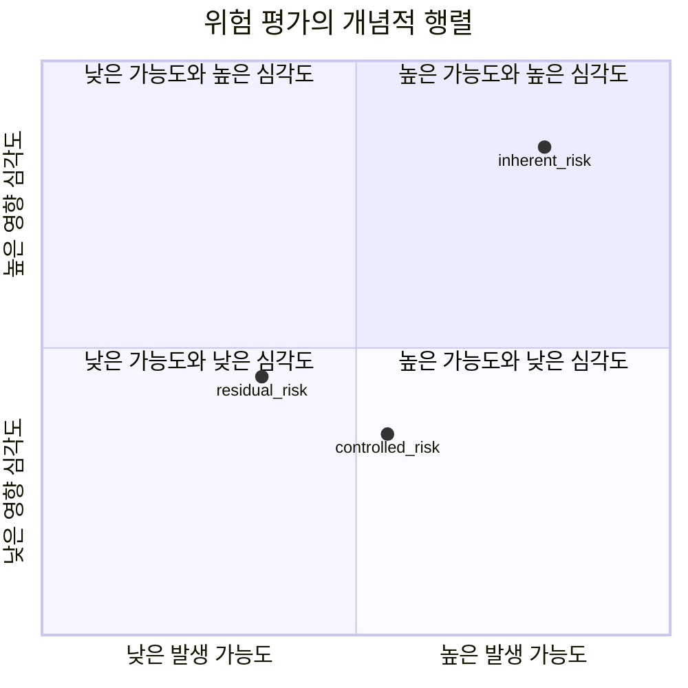

  

# AIF-C01 Task 5.2 Part 2 - ISO 42001·23894 / EU AI Act 3위험 범주 금지·고위험·규제 없음 / GDPR 글로벌 표준 / NIST RMF 4기능 / 위험 행렬 가능성×심각도 / 잔존 위험 / Algorithmic Accountability Act / 설명 가능성 모델 독립 vs 해석 가능

> AI 거버넌스/규정 준수 규제, 6개 강의 중 2번째

## 1. AI 규정 준수 표준 출현

- AI 관련 규정 준수 표준 여전히 출현 이제서야 채택 시작
- **2023 발표 ISO 42001 / ISO 23894** 모두 AI 시스템 위험 평가/관리 메커니즘 규정
- 조직 AI 개발/배포 관련 위험 **체계적 처리/제어 프레임워크 규정**, 책임감 있는 AI 사례 약속 강조 조직 자체 AI 시스템 특정 제어 채택 장려, **글로벌 상호 운용성 촉진 + 책임감 있는 AI 개발/배포 기반 마련 전념**
- 규정 준수 표준 **강력 권장 but 법적 요구 사항 아님**

## 2. EU AI Act - 최초 포괄 규제

- 인공 지능 제안 유럽 규정, 주요 규제 기관 AI 최초 포괄 규제
- AI 애플리케이션 **3가지 위험 범주 분류**

| 범주 | 내용 | 예시 | 요구사항 |
| :--- | :--- | :--- | :--- |
| **1. 용납 불가 위험 - 전면 금지** | | 소셜 행동 따라 개인/그룹 분류 소셜 채점 / 인터넷 얼굴 이미지 스크랩 얼굴 인식 DB / 직장/교육 기관 감정 추론 애플리케이션 | 금지 |
| **2. 고위험** | 구직자 순위 매기는 이력서 스캐닝 도구 등 | 특정 법적 요구 사항 적용 |
| **3. 규제 없음 (대부분)** | 명시 금지 X 고위험 등재 X | 대부분 규제 안받음 | |

- **대부분 AI 시스템 고위험 범주 속함**, 고위험 요구사항: **위험 관리 시스템 구축 / 데이터 거버넌스 수행 / 규정 준수 문서화** 포함
- EU 시민 AI 시스템 제공 안해도 EU 규정 **GDPR 같이 글로벌 표준 되는 경우 많음** → 주의 기울이고 충족 노력 필요

## 3. NIST AI Risk Management Framework (RMF)

- 미국 국립표준기술연구소 릴리스, 신뢰/책임 AI 시스템 개발/사용 촉진 지침 제공
- 목표 조직 AI 시스템 설계/개발/배포/사용 조직 AI 위험 관리 도움 리소스 제공, 신뢰/책임 AI 개발/사용 촉진
- 프레임워크 **자발적**

### 4가지 특정 기능

1. **거버넌스 (Govern)**
2. **매핑 (Map)**
3. **측정 (Measure)**
4. **관리 (Manage)**

### 위험 측정 / 관리 프로세스 (시험)

- NIST RMF: **위험 = 이벤트 발생 가능도 × 결과 심각도 추정** → 위험 행렬 사용 심각도 낮고 가능도 낮은 이벤트 매우 낮은 위험 간주
- AI 시스템 위험 추정:
  1. AI 사용 사례 + 관련 이해 관계자 식별 (특정 사용자 시스템 사용 특정 목표 달성 방법 고려)
  2. 사용 사례 관련 **잠재 유해 이벤트 식별 + 위험 행렬 각 이벤트 위험 결정**
  3. 적절한 **보안 제어/모니터링 완화 가능 내재적 위험 처리**, 보안 제어 강화→발생 가능도↓→전반 위험↓
  4. 내재적 위험 완화 후 남는 위험 = **잔존 위험**
  5. 시스템 전체 위험 등급 위험 수준 요약, **가장 높은 잔존 위험 등급 초점 결정**

## 4. Algorithmic Accountability Act (미국)

- 미국 의회 심의 위해 여러 번 제출, 제정 시 회사 사용/판매 AI 시스템 영향 평가 필요
- 시스템 언제/어떻게 사용 투명성 창출 + 소비자 AI 시스템 상호 작용 시 정보 근거 선택 가능
- 목표 불공정/설명 불가 결과 초래 AI 시스템 미국인 보호
- 예) 소비자 대출 신청 거부 이유 알 권리, 거부 이유 내재적 불공정 편견 때문인지 알 권리

## 5. 생성형 AI 투명성 / 설명 가능성

- 생성형 AI 모델 복잡→출력 심층 도달 방법 이해 어려움
- 최소 투명성: **인간과 소통 않고 생성형 AI 사용 중 사실 최종 사용자 공개 시기 고려**
- 많은 애플리케이션 모델 어떻게 추론 도달했는지 더 자세 설명 필요
- 출력 도달 방식 이해 = **설명 가능성**

### 2가지 접근

| 접근 | 방법 | 예시 |
| :--- | :--- | :--- |
| **모델 독립적** (실현 가능) | 입력/출력 모델 동작 관찰, 실무자 가장 많이 고려 특성 확인, 모델 블랙박스 취급 | 실현 가능 접근 중 하나 |
| **해석 가능 알고리즘/기법** | 모델 가중치 관찰 내부 작동 이해 | 의사결정 트리 / 규칙 기반 시스템 |

- AI/ML 개발 **초기 스테이지 규제 요구 염두 해석 가능성/성능 절충 고려** 필요

## 6. 편향 제거 - 알고리즘 책임성 2번째 이유

- 의사결정 편향 제거 위해
- 목표 개인 다양한 개인적 속성 부적절 사용 결과 영향 안미치도록
- 속성: **인종 / 성별 / 성 정체성 / 종교적 신념 / 정치적 성향 / 도시 또는 시골 거주 여부** 등
- 목표 달성 위해 **모델 결과 + 훈련 데이터 편향 테스트/모니터링 필요**
- **SageMaker Clarify 사용:** 다양한 변수 모델 동작 영향 이해 + 편향/특성 기여도 드리프트 모니터링 가능

## 7. 시험 체크포인트

- 규정 준수 표준 출현 이제 채택 시작 2023 ISO 42001 ISO 23894 AI 시스템 위험 평가 관리 메커니즘 규정 조직 AI 개발 배포 관련 위험 체계적 처리 제어 프레임워크 책임감 있는 AI 사례 약속 강조 조직 자체 AI 시스템 특정 제어 채택 장려 글로벌 상호 운용성 촉진 책임감 있는 개발 배포 기반 마련 전념 강력 권장 법적 요구 아님 EU AI Act 인공 지능 제안 유럽 규정 주요 규제 기관 최초 포괄 규제 AI 애플리케이션 3가지 위험 범주 분류 용납 불가 위험 야기 애플리케이션 시스템 전면 금지 금지 예 소셜 행동 따라 개인 그룹 분류 소셜 채점 인터넷 얼굴 이미지 스크랩 얼굴 인식 DB 직장 교육 기관 감정 추론 애플리케이션 고위험 구직자 순위 이력서 스캐닝 도구 같은 고위험 특정 법적 요구 적용 명시 금지 고위험 등재 안된 애플리케이션 대부분 규제 안받음 대부분 고위험 속함 요구사항 위험 관리 시스템 구축 데이터 거버넌스 규정 준수 문서화 포함 EU 시민 제공 안해도 GDPR 같이 글로벌 표준 되는 경우 많음 주의 충족 노력 미국 NIST RMF 신뢰 책임 AI 개발 사용 촉진 지침 목표 조직 설계 개발 배포 사용 조직 위험 관리 도움 리소스 신뢰 책임 개발 사용 촉진 자발적 4가지 기능 거버넌스 매핑 측정 관리 규정 준수 표준 대부분 위험 측정 관리 관련 NIST 위험 이벤트 발생 가능도 결과 심각도 곱 추정 위험 행렬 심각도 낮고 가능도 낮은 이벤트 매우 낮은 위험 간주 추정 먼저 사용 사례 관련 이해 관계자 식별 특정 사용자 시스템 사용 목표 달성 방법 고려 잠재 유해 이벤트 식별 위험 행렬 각 이벤트 위험 결정 적절한 보안 제어 모니터링 완화 가능 내재적 위험 처리 보안 제어 강화 발생 가능도 줄어 전반 위험 낮아짐 내재적 위험 완화 후 남는 위험 잔존 위험 시스템 전체 위험 등급 위험 수준 요약 가장 높은 잔존 위험 등급 초점 결정
- Algorithmic Accountability Act 미국 의회 심의 여러 번 제출 제정 회사 사용 판매 AI 시스템 영향 평가 필요 언제 어떻게 사용 투명성 창출 소비자 상호 작용 정보 근거 선택 목표 불공정 설명 불가 결과 초래 AI 시스템 보호 예) 소비자 대출 거부 이유 알 권리 거부 이유 내재 불공정 편견 때문인지 알 권리 생성형 모델 복잡 출력 심층 도달 방법 이해 어려움 최소 투명성 인간 소통 않고 생성형 사용 중 사실 최종 사용자 공개 시기 고려 많은 애플리케이션 모델 어떻게 추론 도달 더 자세 설명 필요 출력 도달 방식 이해 설명 가능성 실현 가능 접근 입력 출력 모델 동작 관찰 모델 독립적 접근 가장 많이 고려 특성 확인 블랙박스 취급 해석 쉬운 알고리즘 기법 모델 가중치 관찰 내부 작동 이해 의사결정 트리 규칙 기반 시스템 초기 스테이지 규제 요구 염두 해석 가능성 성능 절충 고려 알고리즘 책임성 두 번째 주요 이유 편향 제거 목표 개인 다양한 개인적 속성 부적절 사용 결과 영향 안미치도록 속성 인종 성별 성 정체성 종교 신념 정치 성향 도시 시골 거주 여부 포함 편향 제거 목표 달성 모델 결과 훈련 데이터 편향 테스트 모니터링 필요 Clarify 다양한 변수 모델 동작 영향 이해 편향 특성 기여도 드리프트 모니터링 가능

## 학습 문서 메타데이터

- 도메인: D5 — AI 솔루션의 보안, 규정 준수 및 거버넌스
- 원본 보존 링크: [AIF-C01-Task5-2-Part2.md](../../../docs/Refs/AIF-C01-Task5-2-Part2.md)
- 이 문서는 원본 본문을 보존한 복사본이며, 이 섹션·도식·네비게이션은 학습용으로 추가했습니다.

이 사분면 차트는 AI 규정 준수 위험을 가능도와 영향 심각도의 두 축 절충으로 개념적으로 비교합니다. 점의 위치는 실제 위험 점수가 아니라 내재적 위험과 잔존 위험을 구분하는 학습 예시입니다.

---

[이전](part-1.md) | [인덱스](README.md) | [다음](part-3.md)
