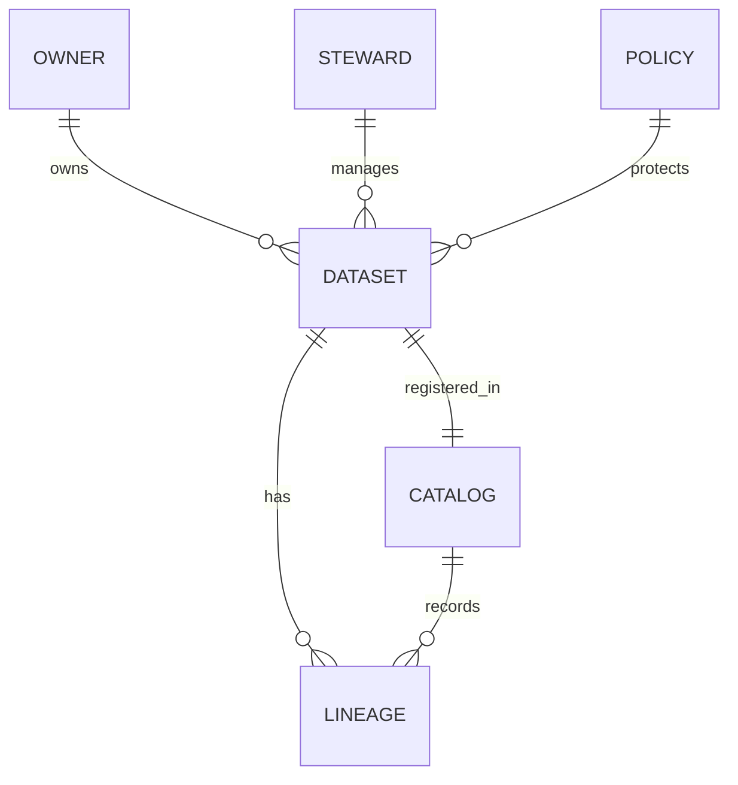

<!-- metadata-badges -->

# AIF-C01 Task 5.2 Part 4 - 데이터 거버넌스 정의·3부분 큐레이션·발견·이해·보호 / 역할 소유자·담당자·IT / 프로파일링·카탈로그·계보 / Glue DataBrew

> 거버넌스/규정 준수 규제, 6개 강의 중 4번째

## 1. 데이터 거버넌스 정의

- **사람/프로세스/기술 조합** 엔터프라이즈 시스템 데이터 **가용성/유용성/무결성/보안 관리** 사용
- 효과적 거버넌스 → 데이터 오용 안되고 일관/신뢰 보장
- 데이터 전략적 자산 취급 보장 + 전략적 자산 효과적 사용 + 권한/제어 통해 이해 관계자 기대 부응 역량 개발 중점
- **대상 지정 비즈니스 이니셔티브 성공 수행 필요 데이터 영역부터 시작**

### 3부분으로 구분

| 구분 | 내용 |
| :--- | :--- |
| **큐레이션** | 대규모 데이터 큐레이팅 → DB/데이터 레이크/데이터 웨어하우스 포함 가장 중요한 데이터 소스 식별/관리, 중요 자산 확산/변형 제한, 정확/최신/민감 정보 없음 보장 → 사용자 데이터 기반 의사결정 확신 |
| **발견/이해** | 상황 맞게 이해 → 의미 검색/이해 비즈니스 가치 창출 자신 있게 사용, 중앙 집중식 카탈로그 쉽게 찾기, 액세스 요청 가능, 비즈니스 결정 사용 |
| **보호** | 개인정보/보안/액세스 적절 균형 유지, 비즈니스/엔지니어링 사용자 모두 직관적 도구 조직 경계 넘어 데이터 관리 가능 |

## 2. 데이터 거버넌스 역할/책임

- 주요 역할 책임 정의, 업무 분담 고려 조직 적절한 개인 할당
- 데이터 소유자 기술+비즈니스 포함 조직 수준 인정 필요
- 데이터 관리 데이터 다루는 모든 비즈니스 담당자 담당

### 역할 정의

| 역할 | 설명 |
| :--- | :--- |
| **데이터 담당자 (Steward)** | 대상 비즈니스 이니셔티브 지원 필요 데이터 자세한 지식 비즈니스 담당자, 일상 프로젝트 세부 관여, 비즈니스 이니셔티브 어려움 초래 데이터 문제 이해 도움 |
| **데이터 소유자 (Owner)** | 규제/규정 준수 정책 포함 데이터 정책 결정 경영진, 예) 누가 클레임 데이터 액세스 가능 / 누가 고객 데이터 액세스 가능 결정 |
| **IT** | 데이터 생성/소비 시스템 탐색 + 담당자 적절한 도구/기능 제공 도움, 예) AWS 데이터 거버넌스 도구 관리/배포 담당 |

- **소유자-담당자 직접 관계:** 담당자 일상 태스크 완료 / 소유자 담당자 태스크 안내 데이터 관련 정책 소유

## 3. 데이터 프로파일링 / 카탈로그 / 계보

- **데이터 프로파일링:** 데이터 체계적 검사 문제 확인 + 특성 다양한 용도 이해
- **데이터 카탈로그:** 액세스 필요 사람들이 데이터 사용 가능
- **데이터 계보:** 특정 데이터 요소 출처 + 이동/변환/저장 방식 식별, 소비자는 보고서 데이터 볼 때 출처/과정 계산 의문 제기 많음

## 4. AWS Glue DataBrew - 비주얼 데이터 준비 (코드 작성 없이)

- 사용자 코드 작성 않고 데이터 정리/정규화 사용 비주얼 도구

### 2가지 거버넌스 유용 기능

**1) 데이터 프로파일링**
- 데이터세트 프로파일링 작업 실행 → 데이터 프로파일 생성
- 프로파일 = 콘텐츠 컨텍스트 / 데이터 구조 / 관계 포함 기존 모양 알려줌
- **데이터 품질 규칙 정의 가능 → 프로파일링 중 검증 → 데이터 문제 탐지**
- S3 / 관계형 DB / 데이터 웨어하우스 저장 데이터 포함 다양한 유형 데이터세트 분석 가능

**2) 데이터 계보**
- 비주얼 인터페이스 데이터 추적 → 데이터 계보 해당 데이터 출처 파악
- 원래 위치에서 다른 엔터티 통해 이동 방식 보여줌
- **출처 / 영향 준 다른 엔터티 / 시간 지남 발생 상황 / 저장 위치 확인 가능**

## 5. 시험 체크포인트

- 데이터 거버넌스 엔터프라이즈 시스템 데이터 가용성 유용성 무결성 보안 관리 사람 프로세스 기술 조합 효과적 거버넌스 오용 안되고 일관 신뢰 보장 3부분 큐레이션 발견 이해 보호 대규모 큐레이팅 DB 데이터 레이크 웨어하우스 포함 가장 중요한 소스 식별 관리 자산 확산 변형 제한 큐레이팅 정확 최신 민감 정보 없음 보장 사용자 의사결정 확신 상황 맞게 이해 의미 검색 이해 비즈니스 가치 창출 자신 있게 사용 중앙 집중 카탈로그 쉽게 찾기 액세스 요청 비즈니스 결정 사용 보호 개인정보 보안 액세스 적절 균형 유지 비즈니스 엔지니어링 사용자 모두 직관적 도구 조직 경계 넘어 관리 전략적 자산 취급 보장 효과적 사용 권한 제어 이해 관계자 기대 부응 역량 개발 중점 대상 지정 비즈니스 이니셔티브 성공 필요 영역부터 시작
- 역할 책임 정의 업무 분담 고려 조직 적절한 개인 할당 소유자 기술 비즈니스 포함 조직 수준 인정 필요 관리 데이터 다루는 모든 비즈니스 담당자 담당 담당자 대상 이니셔티브 지원 필요 데이터 자세한 지식 비즈니스 담당자 일상 프로젝트 세부 관여 어려움 초래 문제 이해 도움 소유자 규제 규정 준수 정책 포함 정책 결정 경영진 누가 클레임 데이터 액세스 가능 누가 고객 데이터 액세스 가능 결정 소유자 담당자 직접 관계 담당자 일상 태스크 완료 소유자 태스크 안내 정책 소유 IT 생성 소비 시스템 탐색 담당자 적절한 도구 기능 제공 도움 AWS 거버넌스 도구 관리 배포 담당 프로파일링 체계적 검사 문제 확인 특성 이해 카탈로그 액세스 필요 사람들 사용 가능 계보 특정 요소 출처 이동 변환 저장 방식 식별 소비자 보고서 볼 때 출처 과정 계산 의문 제기 많음
- Glue DataBrew 코드 작성 않고 데이터 정리 정규화 비주얼 도구 2가지 유용 기능 프로파일링 데이터세트 프로파일링 작업 실행 프로파일 생성 프로파일 콘텐츠 컨텍스트 구조 관계 포함 기존 모양 알려줌 품질 규칙 정의 가능 검증 탐지 S3 관계형 DB 웨어하우스 다양한 유형 분석 가능 계보 비주얼 인터페이스 데이터 추적 계보 출처 파악 원래 위치 다른 엔터티 통해 이동 방식 출처 영향 준 엔터티 시간 지남 발생 상황 저장 위치 확인 가능

## 학습 문서 메타데이터

- 도메인: D5 — AI 솔루션의 보안, 규정 준수 및 거버넌스
- 원본 보존 링크: [AIF-C01-Task5-2-Part4.md](../../../docs/Refs/AIF-C01-Task5-2-Part4.md)
- 이 문서는 원본 본문을 보존한 복사본이며, 이 섹션·도식·네비게이션은 학습용으로 추가했습니다.

이 ER 다이어그램은 데이터셋·카탈로그·역할·정책·계보가 연결되는 데이터 거버넌스 관계를 보여 줍니다. Mermaid가 렌더링되지 않아도 데이터의 소유·발견·보호와 변환 이력을 읽을 수 있습니다.

---

[이전](part-3.md) | [인덱스](README.md) | [다음](part-5.md)
