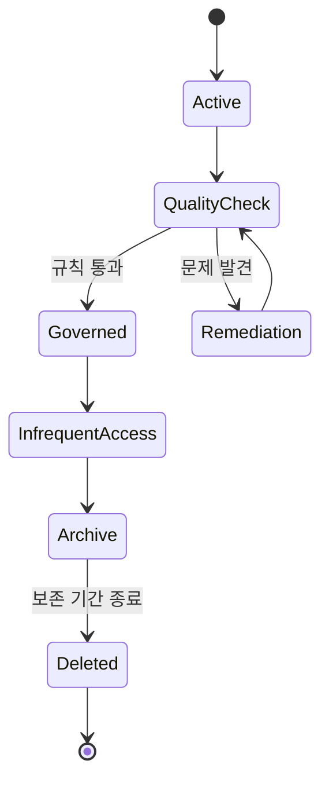

<!-- metadata-badges -->

<kbd>도메인 D5</kbd> <kbd>입문</kbd> <kbd>초안</kbd>

# AIF-C01 Task 5.2 Part 5 - 데이터 품질 관리·통합·기본 데이터 관리·Glue Data Catalog·Glue Data Quality·보안·규정 준수·수명 주기 관리·Lake Formation·S3 스토리지 등급·수명 주기 규칙

> 거버넌스/규정 준수 규제, 6개 강의 중 5번째

## 1. 데이터 품질 관리

- **프로파일링 또는 다른 수단 검색 품질 문제 해결**
- 가능 시 **근본 원인 파악 필요** → 데이터 + 대상 이니셔티브 역할 비즈니스/기술 지식 필요
- 원인 관련 시 문제 수정 가능 데이터 담당자/비즈니스 사용자 알리고 보고 필요

## 2. 데이터 통합

- **다양한 소스 수집/병합**, 다양한 소스 데이터 일관되게 연결되도록 해야 함 → 모든 데이터 결합 더 완전한 그림

### 기본 데이터 관리 (Master Data Management)

- 고객/공급업체/제품 같은 **기본 데이터 특별 고려**
- 예) 동일 고객 정보 서로 다른 사업 분야 관련 시스템 별도 저장
- **기본 데이터 관리 = 유형 데이터 조정 서로 다른 시스템 제공 공통 데이터 일관되도록**
- 예) 이메일 주소/이름 철자 오류 조정
- 데이터 담당자 **조정 규칙 정의 + 계층 구조 관리 도움**

## 3. AWS Glue Data Catalog

- 데이터 소스 메타데이터 저장, 메타데이터 = **데이터 형식/테이블 정의 포함 위치/스키마 정보**
- 카탈로그 **수동 채우거나 크롤러 작업 정의:** 데이터 소스 스캔 + 카탈로그 자동 채움

## 4. AWS Glue Data Quality

- Data Catalog 저장 객체 평가
- **코더 아닌 사람 데이터 품질 규칙 설정 간단 방법 제공:** 품질 규칙 권장 + ML 자동 사용 데이터 이상 탐지 포함
- 규칙 세트 정의 시 Data Quality 작업 실행 가능 → 콘솔 통과/실패 규칙 결과 검토

## 5. 데이터 보안 / 규정 준수 / 수명 주기 관리 - 균형

### 데이터 보안

- 데이터 액세스 가능 사람 + 경우 정의, 예) 고객 서비스/영업 특정 역할 특정 고객 데이터 자동 액세스 필요
- 일반적으로 담당자 소유자 설정 정책 결정 따라 **역할 기반/임시 액세스 가능하도록 도움**

### 규정 준수

- 정부 규제 이해 + 준수 확인, 보장 위해 소유자 보안/법률 팀 협력 민감 데이터 영역 정책 결정, 규칙 데이터 비즈니스 사용 방식 해석/판단/지식 필요한 경우 많음

### 수명 주기 관리

- 간단히 **액세스 + 비용 최적화 위해 의도적 저장**
- 거버넌스는 적절한 제어 통해 안전 보호 + 필요 시 적절한 사용자/앱 제공 → **제어와 액세스 간 균형**, 제어 너무 많음 → 사일로 갇힘 인사이트/혁신 사용 어려움 / 충분 X → 데이터/비즈니스 위험

## 6. AWS Lake Formation - 세분화된 액세스 제어

- **S3 구축 + Glue Data Catalog 사용 카탈로그 작성 데이터 레이크 세분화된 액세스 제어 관리**
- 권한 AWS 분석/ML 서비스 전반 **열/행/셀 수준 세분화 제어** 적용
- **데이터 사일로 허물고 다양한 형식 정형/비정형 데이터 중앙 집중식 리포지토리 결합 도움**
- S3 또는 관계형/NoSQL DB 기존 데이터 스토어 식별 + 데이터 데이터 레이크로 이동 가능, 카탈로그 작성 + 권한 설정
- 사용자 **Athena / Glue / EMR / Redshift 같은 통합 분석 엔진 사용 액세스 시도 시 Data Catalog 액세스 권한 부여 전 Lake Formation 통해 권한 확인**

## 7. 모델 훈련 데이터 보관 + S3 스토리지 등급 / 수명 주기 규칙

- 훈련 데이터 일반적으로 S3 저장, 훈련 사용 후 다시 액세스 필요 없지만 **규정 준수 위해 유지 필요 가능**

### S3 스토리지 등급 (시험)

| 등급 | 용도 | 특징 |
| :--- | :--- | :--- |
| **S3 Standard** | 자주 액세스 데이터 | |
| **S3 Standard IA / One Zone IA** | 비교적 자주 액세스 X but 필요 시 빠르게 검색 필요 데이터 | 스토리지 비용 Standard보다 저렴 but 검색 비용 더 많이 듦 |
| **S3 Intelligent-Tiering** | 액세스 패턴 알 수 없거나 변화 데이터 | 액세스 빈도 낮은 객체 저렴한 IA 계층 자동 이동 |
| **S3 Glacier** | 거의 액세스 X 데이터 주로 보존/규정 준수 장기 아카이브 유지 | 다양한 등급 필요 시 아카이브 데이터 빨리 검색 속도 옵션 제공 |

### 수명 주기 규칙

- 데이터 액세스 패턴 알면 **버킷 수명 주기 규칙 생성** 필요
- 규칙 조건 충족 시 데이터 자주 액세스 안하는 계층 + 아카이브 계층 이동
- 각 규칙 대상 스토리지 등급 + 데이터 전환 필요 생성 후 일수 지정, 더 이상 유지 필요 없을 시 삭제 규칙 생성 선택 가능
- 예) **생성 후 5일 Standard→Standard IA 전환 / 120일 후 Glacier Deep Archive 이동 / 5년 후 삭제**

## 8. 시험 체크포인트

- 품질 관리 프로파일링 다른 수단 검색 품질 문제 해결 가능 시 근본 원인 파악 필요 비즈니스 기술 지식 필요 원인 관련 문제 수정 가능 담당자 비즈니스 사용자 알리고 보고 필요 통합 다양한 소스 수집 병합 일관되게 연결 모든 데이터 결합 완전한 그림 기본 데이터 고객 공급업체 제품 같은 기본 데이터 특별 고려 동일 고객 정보 다른 사업 분야 시스템 별도 저장 기본 데이터 관리 유형 데이터 조정 다른 시스템 제공 공통 데이터 일관 이메일 주소 이름 철자 오류 조정 담당자 조정 규칙 정의 계층 구조 관리 도움 Glue Data Catalog 데이터 소스 메타데이터 저장 형식 테이블 정의 포함 위치 스키마 정보 카탈로그 수동 채우거나 크롤러 작업 정의 소스 스캔 자동 채움 Data Quality Data Catalog 저장 객체 평가 코더 아닌 사람 품질 규칙 설정 간단 방법 규칙 권장 ML 자동 이상 탐지 포함 규칙 세트 정의 Data Quality 작업 실행 콘솔 통과 실패 결과 검토
- 보안 데이터 액세스 가능 사람 경우 정의 예) 고객 서비스 영업 특정 역할 특정 고객 데이터 자동 액세스 필요 담당자 소유자 설정 정책 결정 따라 역할 기반 임시 액세스 가능 도움 규정 준수 정부 규제 이해 준수 확인 보장 소유자 보안 법률 팀 협력 민감 영역 정책 결정 규칙 데이터 비즈니스 사용 방식 해석 판단 지식 필요한 경우 많음 수명 주기 관리 간단히 액세스 비용 최적화 의도적 저장 거버넌스 적절한 제어 안전 보호 필요 시 적절한 사용자 앱 제공 제어 액세스 간 균형 제어 너무 많음 사일로 갇힘 인사이트 혁신 사용 어려움 충분 X 데이터 비즈니스 위험 Lake Formation S3 구축 Glue Data Catalog 사용 카탈로그 작성 데이터 레이크 세분화 액세스 제어 관리 권한 분석 ML 서비스 전반 열 행 셀 수준 세분화 제어 적용 사일로 허물고 다양한 형식 정형 비정형 중앙 집중식 결합 도움 S3 관계형 NoSQL 기존 스토어 식별 데이터 레이크로 이동 카탈로그 작성 권한 설정 사용자 Athena Glue EMR Redshift 통합 분석 엔진 액세스 시도 시 Data Catalog 액세스 권한 부여 전 Lake Formation 통해 권한 확인 훈련 데이터 S3 저장 훈련 후 다시 액세스 필요 없지만 규정 준수 유지 필요 가능 S3 Standard 자주 액세스 Standard IA One Zone IA 비교적 자주 액세스 X 필요 시 빠르게 검색 저장 등급 스토리지 비용 저렴 검색 비용 더 많이 듦 Intelligent-Tiering 액세스 패턴 알 수 없거나 변화 데이터 빈도 낮은 객체 저렴 IA 자동 이동 Glacier 거의 액세스 X 주로 보존 규정 준수 장기 아카이브 유지 다양한 등급 필요 시 빨리 검색 속도 옵션 제공 액세스 패턴 알면 수명 주기 규칙 버킷 생성 필요 조건 충족 시 자주 액세스 안하는 계층 아카이브 이동 각 규칙 대상 등급 생성 후 일수 지정 유지 필요 없을 시 삭제 규칙 생성 선택 예) 5일 Standard Standard IA 전환 120일 Glacier Deep Archive 5년 삭제

## 학습 문서 메타데이터

- 도메인: D5 — AI 솔루션의 보안, 규정 준수 및 거버넌스
- 원본 보존 링크: [AIF-C01-Task5-2-Part5.md](../../../docs/Refs/AIF-C01-Task5-2-Part5.md)
- 이 문서는 원본 본문을 보존한 복사본이며, 이 섹션·도식·네비게이션은 학습용으로 추가했습니다.

이 상태 다이어그램은 훈련 데이터가 접근·품질·보안 정책에 따라 관리되고, 수명 주기 전환과 아카이브·삭제 상태로 이동하는 과정을 보여 줍니다. Mermaid가 렌더링되지 않아도 S3 등급과 거버넌스 검토의 순서를 읽을 수 있습니다.

---

[이전](part-4.md) | [인덱스](README.md) | [다음](part-6.md)
