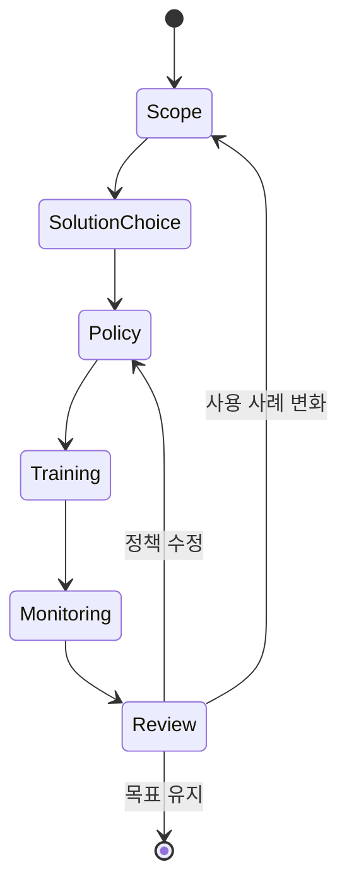

  

# AIF-C01 Task 5.2 Part 6 - AI 거버넌스 전략 구현 단계 / 책임 범위 식별·5범위 매트릭스·솔루션 찾기 왼쪽→오른쪽 Comprehend·Translate→Bedrock RAG→JumpStart 미세 조정 / 정책 문서화·교육·모니터링 메커니즘·검토 수정 (5.2 마무리)

> 거버넌스/규정 준수 규제, 6개 강의 중 6번째 (마무리)

## 1. AI 거버넌스 전략 구현 단계

### 단계 1: 책임 범위 식별

- 책임: **거버넌스/규정 준수 / 법적/개인정보 보호 / 위험 관리 / 보안 제어 구현 / 모델 복원력** 포함 가능
- **생성형 AI 보안 범위 지정 행렬:** AI 사용/구현 방식 따라 증가 범위 수준 보여줌

| 범위 | 설명 | 책임 | 데이터 사용 |
| :--- | :--- | :--- | :--- |
| **범위 1·2** | 서드 파티 소비자 또는 엔터프라이즈 애플리케이션 사용 | 책임 가장 적음 | |
| **범위 3·4·5** | 사용자 고유 AI 솔루션 구축 | 사용자 데이터/모델 위험 분류 / 위협 모델링 구현 / 액세스 제한 / 보안 제어 구현 / 모델 엔드포인트 복원력 보장 담당 | 모델 훈련 / 미세 조정 / 출력 사용 가능 |

- 범위 증가 따라 거버넌스/규정 준수 책임 변경 예시 보여줌

### 솔루션 찾기 - 왼쪽→오른쪽 최소화 원칙

- AWS 각 범위 서비스 제공
- 가장 중요: **완전 훈련 AI 서비스부터 시작 왼쪽→오른쪽 솔루션 찾기**
  1. **완전 훈련 AI 서비스:** Amazon Comprehend / Amazon Translate 등, 서드 파티 모델 필요 모든 데이터/기능 있으면 범위 1·2 애플리케이션 요구 적합 가능
  2. 요구 충족 안하면 **사전 훈련 모델:** Amazon Bedrock 같은 사전 훈련 모델 + **검색 증강 생성(RAG)** 향상
  3. 또는 **사전 훈련 but 자체 데이터 미세 조정 가능 모델:** SageMaker JumpStart 사용 모델 등 고려
- **범위 최소화 → 법적·개인정보·위험 관리·보안 제어·모델 복원력과 함께 거버넌스/규정 준수 책임 최소화**

### 단계 2: 정책 문서화 + 교육

- 범위 결정 즉시 **AI 거버넌스 정책 문서화 + 직원 책임 교육**
- 직원 책임 직무 역할/액세스 수준 따라 달라짐
- 정책 포함: **데이터 거버넌스 / 액세스 요청 / 모델 투명성 표준 설정**
- 비즈니스 필요 규정 준수/자격증 사용 정책/모범 사례 안내

### 단계 3: 모니터링 메커니즘 정의

- **AI 시스템 / 성능 / 규정 준수 / 편향 모니터링 메커니즘 정의 + 미리 정의 임계값 따라 작업 결정**

### 단계 4: 자주 검토 + 수정

- **비즈니스 목표/ AI 안전성 부합하도록 결과 자주 검토 + 필요 기존 정책 수정**

## 2. 시험 체크포인트

- 거버넌스 전략 구현 단계 책임 범위 식별 책임 거버넌스 규정 준수 법적 개인정보 보호 위험 관리 보안 제어 구현 모델 복원력 포함 가능 생성형 AI 보안 범위 지정 행렬 AI 사용 구현 방식 따라 증가 범위 수준 범위 1 2 서드 파티 소비자 엔터프라이즈 애플리케이션 사용 책임 가장 적음 범위 3 4 5 사용자 고유 AI 솔루션 구축 데이터 모델 훈련 미세 조정 출력 사용 가능 사용자 데이터 모델 위험 분류 위협 모델링 구현 액세스 제한 보안 제어 구현 모델 엔드포인트 복원력 보장 담당 범위 증가 거버넌스 규정 준수 책임 변경 예 과정 전반 AWS 각 범위 서비스 제공 가장 중요 완전 훈련 AI 서비스부터 시작 왼쪽 오른쪽 솔루션 찾기 Comprehend Translate 같이 완전 훈련 AI 서비스 서드 파티 모델 필요 모든 데이터 기능 있으면 범위 1 범위 2 애플리케이션 요구 적합 가능 요구 충족 안하면 검색 증강 생성 향상 가능 Bedrock 같은 사전 훈련 모델 찾기 또는 JumpStart 같이 사전 훈련 but 자체 데이터 미세 조정 가능 모델 고려 범위 최소화 법적 개인정보 보호 위험 관리 보안 제어 구현 모델 복원력과 함께 거버넌스 규정 준수 책임 최소화 범위 결정 즉시 다음 단계 AI 거버넌스 정책 문서화 직원 책임 교육 직원 책임 직무 역할 액세스 수준 따라 달라짐 정책 데이터 거버넌스 액세스 요청 모델 투명성 표준 설정 포함 비즈니스 필요 규정 준수 자격증 사용 정책 모범 사례 안내 AI 시스템 성능 규정 준수 편향 모니터링 메커니즘 정의 미리 정의 임계값 따라 작업 결정 마지막 비즈니스 목표 AI 안전성 부합하도록 결과 자주 검토 필요 기존 정책 수정

## 학습 문서 메타데이터

- 도메인: D5 — AI 솔루션의 보안, 규정 준수 및 거버넌스
- 원본 보존 링크: [AIF-C01-Task5-2-Part6.md](../../../docs/Refs/AIF-C01-Task5-2-Part6.md)
- 이 문서는 원본 본문을 보존한 복사본이며, 이 섹션·도식·네비게이션은 학습용으로 추가했습니다.

이 상태 다이어그램은 AI 거버넌스가 책임 범위 식별에서 정책 문서화·모니터링·정기 검토로 전환되는 운영 주기를 보여 줍니다. Mermaid가 렌더링되지 않아도 범위 최소화와 정책 개선의 반복을 읽을 수 있습니다.

---

[이전](part-5.md) | [인덱스](README.md) | 없음
