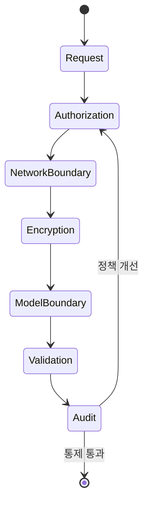

<!-- metadata-badges -->

<kbd>도메인 D5</kbd> <kbd>입문</kbd> <kbd>초안</kbd>

# AIF-C01 Task 5.0 Overview - 영역 5 : AI 솔루션 보안/규정 준수/거버넌스

> 보안/규정 준수/거버넌스, 2개 태스크 목표

## 영역 5 구성

- **Task 5.1:** AI 시스템 보호 방법 설명
- **Task 5.2:** AI 시스템 거버넌스/규정 준수 규제 인식

## Task 5.1 요구 사항 - AI 시스템 보호

- 자격 증명/액세스 관리 AWS 작동 방식 기본 이해
- AI 애플리케이션/데이터 보호 AWS와 고객 간 **공동 책임** 방식 이해
- AI 시스템 공격/도용 취약한 몇 가지 방식 이해 + 취약성 완화 모범 사례 설명 가능

## Task 5.2 요구 사항 - 거버넌스/규정 준수 규제

- AI 시스템 몇 가지 규정 준수 표준 이해 + 이러한 표준 충족 사용 AWS 서비스/전략/프로세스 식별 가능

## 시험 체크포인트

- 영역 5 AI 솔루션 보안 규정 준수 거버넌스 2개 태스크 목표 5.1 AI 시스템 보호 방법 설명 5.2 AI 시스템 거버넌스 규정 준수 규제 인식 5.1 자격 증명 액세스 관리 AWS 작동 방식 기본 AI 애플리케이션 데이터 보호 AWS 고객 공동 책임 AI 시스템 공격 도용 취약 방식 취약성 완화 모범 사례 5.2 AI 시스템 규정 준수 표준 이해 표준 충족 사용 AWS 서비스 전략 프로세스 식별

## 학습 문서 메타데이터

- 도메인: D5 — AI 솔루션의 보안, 규정 준수 및 거버넌스
- 원본 보존 링크: [AIF-C01-Task5-Intro.md](../../../docs/Refs/AIF-C01-Task5-Intro.md)
- 이 문서는 원본 본문을 보존한 복사본이며, 이 섹션·도식·네비게이션은 학습용으로 추가했습니다.

이 상태 다이어그램은 AI 요청이 권한·네트워크·암호화·모델 검증·감사 상태를 순서대로 통과하고 정책 개선으로 되돌아가는 상태 전이를 보여 줍니다. Mermaid가 렌더링되지 않아도 보안 통제의 순서를 읽을 수 있습니다.

---

없음 | [인덱스](README.md) | [다음](../task-5-1/part-1.md)
