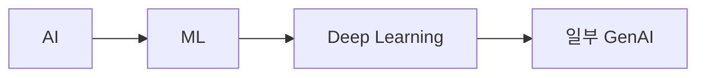

# U2 D1 AI 및 ML의 기초 기술 결정

## 목적과 경계

U2는 `u2-d1-ai-ml-foundations` 정적 콘텐츠 Unit이다. 목표는 초보자가 D1 문서를 읽고 기준선·출처·용어·다음 문서로 이동하도록 하는 것이며, 실행형 학습 앱이나 AWS 리소스를 만드는 것이 아니다. 이 결정은 [U2 Unit 계약](../../../inception/units-generation/unit-of-work.md), [D1 요구사항](../../../inception/requirements-analysis/requirements.md), [D1 README](../../../../../../../../docs/01-ai-ml-foundations/README.md)를 구현 가능한 문서 규칙으로 구체화한다.

## 단계 upstream 적용성

공통 nfr-requirements 입력인 `functional-spec`, `rules`, `requirements`를 U2의 `packaging` 경계에 맞춰 판정한다. `requirements`는 승인된 요구사항 파일을 직접 소비한다. `rules`는 정적 문서·출처 추적·초보자 품질 규칙으로 적용한다. `functional-spec`은 서비스 동작이나 API 계약이 없는 U2에서는 별도 기능 명세를 생성하지 않는 `N/A` 입력이며, Unit 계약과 요구사항으로 문서 범위를 확인한다. 이 조건부 판정을 `traceability.json`에도 기록하여 필수 upstream 이름이 누락되지 않도록 한다.

## 결정 요약

| 결정 ID | 선택 | 적용 대상 | 이유 |
|---|---|---|---|
| TECH2.1 | UTF-8 Markdown + YAML front matter | D1 README·개념 문서·NFR 문서 | 한국어와 핵심 영어 토큰을 보존하고 일반 Markdown/GitHub에서 읽힌다. `title`, `domain`, `level`, `status`, `source_urls`, `source_checked`로 문서 상태와 출처를 기계적으로 점검한다. |
| TECH2.2 | 저장소 상대 Markdown 링크 | D1 문서·glossary·D2 다음 문서 연결 | 호스트·계정·배포 환경에 종속되지 않고 모바일에서도 탐색 경로를 유지한다. |
| TECH2.3 | U1 canonical source registry 참조 | 공식 URL·제목·확인일·접근 상태 | U2가 출처 메타데이터를 복제해 revision 불일치를 만들지 않는다. 시험 범위의 1차 근거는 AWS Certification 공식 안내서다. |
| TECH2.4 | 결정적 JSON 추적표 | `traceability.json` | 센서가 upstream ID·AC·상세 NFR·Unit·component 연결을 반복 검사할 수 있다. 키와 배열 순서는 고정한다. |
| TECH2.5 | 기존 Bun 검사 도구 최소 의존성 | required-sections, upstream-coverage, traceability, linter, type-check | 새 패키지·SDK·빌드 체계를 추가하지 않고 저장소의 기존 검사 경로를 재사용한다. |
| TECH2.6 | Mermaid는 선택적이며 텍스트 fallback 필수 | 문서 구조를 설명하는 간단한 다이어그램 | 외부 렌더러가 없어도 노드·순서·결론을 읽게 한다. 도식이 학습 가치를 높이지 않으면 평문 목록을 사용한다. |
| TECH2.7 | 버전 관리형 정적 패키지 | `docs/`, `sources/`, `aidlc/` 산출물 | 같은 입력·같은 source_checked 값으로 재실행해 동일한 ID·링크·추적 결과를 얻는다. 네트워크·계정·비밀을 검사 전제에서 제거한다. |
| TECH2.8 | 상태 분리 | 문서 `draft|review|verified`, 출처 `discovered|downloaded|summarized|reviewed|verified|blocked` | 출처 확인 수준과 문서 검토 수준을 혼동하지 않는다. 확인되지 않은 출처를 이용한 문서는 `verified`가 될 수 없다. |
| TECH2.9 | Anki·CSV는 U7 계약으로 위임 | U2의 용어 inventory와 D1 문서 링크 | U2는 glossary·문서 원본을 소유하고, 카드·퀴즈·Anki의 교환 파일은 U7이 소유한다. 중복 소유와 추적성 충돌을 막는다. |

## 문서 구조 결정

D1 문서는 다음 순서를 기본으로 한다. 각 문서는 하나의 핵심 개념 또는 밀접한 작은 묶음만 다룬다.

1. 이 문서에서 배울 것
2. 선수 지식과 한 줄 요약
3. 핵심 개념을 쉬운 말로 설명
4. AWS 관점과 관련 서비스
5. 비슷한 개념·서비스 비교
6. 실무형 시나리오
7. 시험에서 판단하는 단서
8. 자주 하는 오해
9. 핵심 정리
10. 스스로 답하는 확인 질문
11. 연결된 다음 문서
12. 출처

각 외부 사실에는 공식 URL·제목·확인일·상태를 연결하고, 각 문서에는 YAML front matter와 문서 상태를 둔다. 시험 범위 섹션과 실무 확장 섹션을 섞을 때는 섹션별 표지를 사용한다.

## 탐색·접근성 결정

- 현재 문서에서 [D1 README](../../../../../../../../docs/01-ai-ml-foundations/README.md)로 돌아가고, 개념 문서 사이에는 설명적인 상대 링크를 둔다.
- 용어는 [D1 용어 inventory](../../../../../../../../docs/01-ai-ml-foundations/d1-terminology-quiz.md)와 연결하는 계약을 둔다. 중앙 `docs/glossary.md`가 없으므로 U2는 임시 용어 연결과 미해결 상태를 추적하고, 중앙 파일 생성 시 링크 검사를 다시 실행한다.
- D1 완료 뒤에는 [D2 README](../../../../../../../../docs/02-generative-ai/README.md)로 이동한다. 다음 문서 링크는 링크 대상의 제목과 목적을 설명한다.
- 표는 모바일에서 열 수를 줄이고, 한 행에 한 판단을 둔다. 긴 비교는 짧은 목록 또는 여러 표로 분리한다.
- Mermaid를 쓸 경우 다음 텍스트 설명을 함께 둔다. 아래 관계가 핵심이다.

텍스트 fallback: AI는 가장 넓은 목표이고, ML은 데이터에서 패턴을 학습하는 방법이며, 딥 러닝은 신경망 기반 ML이다. GenAI는 그중 일부 접근으로 새로운 콘텐츠를 만들 수 있다. 이 도식은 서비스 배포나 API 호출을 뜻하지 않는다.

## 검사·재현성 결정

검사 기준은 현재 저장소의 Bun 도구를 우선한다.

| 검사 | U2 대상 | 판정 |
|---|---|---|
| required-sections | 두 Markdown의 front matter, 핵심 H2, `## Sources`, `## Review` | 필수 제목·내용이 없으면 실패 |
| upstream-coverage | requirements, stories, unit-of-work, source registry, D1 문서 | 승인된 upstream 경로와 ID가 본문·추적표에서 확인되어야 함 |
| traceability | `traceability.json`, requirements의 NFR/FR, stories의 AC, U2 계약 | upstream·AC·상세 NFR·Unit·component의 누락·고아 0건 |
| linter | Markdown 안 코드 블록 | TypeScript/JavaScript 코드가 없으면 `not applicable`을 기록 |
| type-check | 산출물에 포함한 TypeScript/JavaScript | 코드가 없으면 `not applicable`을 기록 |
| UTF-8·링크·민감정보 | 세 산출물과 참조 문서 | UTF-8, 상대 링크, secret/PII 패턴 부재 |

검사는 로컬 checkout에서 읽기 전용으로 실행하고 날짜·도구·대상·출력 요약을 `traceability.json`의 `validation_evidence`에 기록한다. 검사 결과를 생성 파일의 내용에 섞어 넣지 않고, 결과는 별도 품질 증거와 단계 기록으로 연결한다.

## 해당 없음 결정

| 항목 | 상태 | 근거 |
|---|---|---|
| Runtime | 해당 없음 | D1 문서는 정적 Markdown이며 실행 프로세스·세션·요청 처리가 없다. |
| API/HTTP 서버 | 해당 없음 | 문서 링크는 탐색·출처 링크이고 공개 API 계약이 아니다. |
| Database/검색 인덱스 | 해당 없음 | 문서·용어·추적성은 Git 버전 관리형 Markdown/JSON이다. 학습자 답안·진도·계정을 저장하지 않는다. |
| AWS account/credentials | 해당 없음 | AWS 계정, IAM, API key, token, secret, 유료 리소스를 사용하지 않는다. |
| Deployment/hosting | 해당 없음 | `shared static package`를 저장소에서 전달하며 staging·production 배포를 설계하지 않는다. |
| Runtime scalability/availability/DR | 해당 없음 | 서비스 트래픽·가용성·복구 목표가 없고 정적 파일 재현성과 변경 이력이 대응 품질 속성이다. |
| Web UI framework | 해당 없음 | Markdown viewer의 기본 열람 기능만 사용하며 별도 UI를 개발하지 않는다. |
| New npm/Bun dependency | 해당 없음 | 기존 Bun 검사 도구로 충분하며 새 의존성은 공급망·lockfile 부담을 추가한다. |

## 대안과 트레이드오프

### 단일 웹 애플리케이션

검색·진도 저장은 편해질 수 있지만 계정·API·DB·배포·개인정보 경계를 만든다. 승인된 정적 학습 가이드와 충돌하므로 선택하지 않았다.

### 중앙 데이터베이스

추적성 조회는 쉬워질 수 있으나 문서 리뷰와 offline 열람을 어렵게 하고 운영·백업·접근 제어를 도입한다. 버전 관리형 JSON과 상대 링크가 현재 규모에 충분하다.

### 새 Markdown/YAML 패키지 추가

일부 파싱 편의는 얻지만 lockfile·공급망·버전 변동이 늘어난다. 현재 Bun 센서와 표준 파서 검사를 먼저 사용하고 결손이 증명될 때만 별도 의존성을 검토한다.

## 핵심 정리

U2는 UTF-8 Markdown, YAML front matter, 저장소 상대 링크, U1 출처 계약, 결정적 JSON 추적표와 기존 Bun 검사를 사용한다. Runtime/API/DB/AWS account/deployment는 해당 없음이며, 새 패키지와 외부 렌더러에 의존하지 않는다.

## Sources

- [AWS Certified AI Practitioner(AIF-C01) 시험 안내서](https://docs.aws.amazon.com/ko_kr/aws-certification/latest/ai-practitioner-01/ai-practitioner-01.html) — 시험 범위·도메인 가중치 기준, 확인일: 2026-09-04, 상태: `downloaded`
- [콘텐츠 도메인 1: AI 및 ML의 기초](https://docs.aws.amazon.com/ko_kr/aws-certification/latest/ai-practitioner-01/ai-practitioner-01-domain1.html) — D1 작업·기술 기준, 확인일: 2026-09-04, 상태: `downloaded`
- [U2 Unit 계약](../../../inception/units-generation/unit-of-work.md) — U2 경계·산출물·소유권 기준, 내부 출처 확인일: 2026-09-04, 상태: `reviewed`
- [승인된 컴포넌트 카탈로그](../../../inception/domain-design/components.md) — `LearningContent`·`GlossaryTerm` 소유권 기준, 내부 출처 확인일: 2026-09-04, 상태: `reviewed`
- [AIF-C01 requirements.md](../../../inception/requirements-analysis/requirements.md) — 승인된 FR/NFR·정적 범위 기준, 내부 출처 확인일: 2026-09-04, 상태: `reviewed`

## Assumptions & Open Questions

- U1이 `AIF-C01-D1-T<n>` 행과 source registry 상태를 확정하기 전에는 U2의 파생 문서를 `verified`로 승격하지 않는다.
- `docs/glossary.md`는 U2가 연결해야 할 중앙 대상이지만 현재 저장소에 없다. 생성 주체와 시점은 후속 집필 단계에서 확정한다.
- D1의 AWS 서비스 기능·요금·리전·할당량은 작성일 기준 공식 문서에서 별도 재확인해야 한다.

## Review

### architecture 관점

**READY**. 선택한 기술은 `LearningContent`의 static packaging 경계에 맞고 U1의 source registry를 단일 참조점으로 유지한다. API·DB·배포 토폴로지를 이 Unit에 끌어오지 않았다.

### security 관점

**READY**. 새 실행 의존성·AWS 계정·자격 증명·외부 업로드를 배제하고, 상태·ID·상대 링크·UTF-8·재현성으로 문서 무결성을 관리한다.

### quality 관점

**READY**. 기존 Bun 센서, Markdown 필수 섹션, traceability, linter/type-check 비적용 판정, 모바일·Mermaid fallback·glossary·다음 문서 연결을 검사 가능한 결정으로 남겼다.

### 미해결 사항

`docs/glossary.md` 생성과 U1 공식 기준선 행의 최종 확정이 남아 있다. 두 항목은 후속 콘텐츠·출처 단계에서 해결하고, 그 전까지 상태는 `review`로 유지한다.
