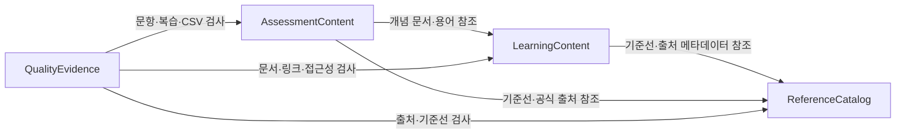

# 논리적 컴포넌트 카탈로그

> 상태: `draft`  
> 설계 범위: AIF-C01 완전 초보자용 한국어 정적 Markdown·CSV 학습 가이드  
> 통합 요약 확인: `Looks correct`  
> 설계 원칙: 변경·검토·추적 책임은 분리하되 실행형 애플리케이션·API·데이터베이스·학습자 데이터 저장은 만들지 않는다.

## Machine-readable component catalogue

```yaml
components:
  - name: ReferenceCatalog
    summary: 공식 시험 기준선과 출처 메타데이터의 단일 소유자
    behaviour: >
      공식 AIF-C01 시험 안내서의 revision, 도메인, 작업·기술 행을
      AIF-C01-D<n>-T<n> 안정 ID로 등록하고, 사이드바 링크와 source registry의
      URL·제목·확인일·접근 상태를 관리한다. 차단되거나 확인되지 않은 출처는
      verified 파생 자료에 사용되지 않도록 상태와 후속 조치를 보존한다.
    responsibilities:
      - 공식 시험 기준선과 revision 메타데이터 소유
      - AWS 공식 출처와 사이드바 링크 인벤토리 소유
      - 파생 자료가 참조할 안정 기준선·출처 ID 제공
      - 차단·확인 필요 상태와 영향 범위 기록
    depends_on: []
    dependents:
      - component: LearningContent
        interaction: 학습 문서가 기준선·출처 메타데이터와 범위 표지를 참조
      - component: AssessmentContent
        interaction: 문항·카드·퀴즈·Anki가 기준선과 공식 출처를 참조
      - component: QualityEvidence
        interaction: 품질 검사가 출처 상태와 기준선 완전성을 확인
    external_dependencies:
      - name: AWS Certification AIF-C01 official exam guide
        kind: other
        purpose: 공식 도메인·채점 비율·작업·기술 기준선의 원출처
      - name: AWS official documentation pages
        kind: other
        purpose: 서비스·개념 설명과 변동 사실의 공식 근거
    entities:
      - name: BaselineItem
        identifier: baseline_id
        attributes: [baseline_id, revision_title, domain, task, technology, official_source_url, official_source_title, checked_date, status, notes]
      - name: SourceRecord
        identifier: source_id
        attributes: [source_id, url, title, source_type, parent_topic, domain_mappings, checked_date, access_status, linked_document_ids]
      - name: SidebarLink
        identifier: link_id
        attributes: [link_id, url, title, parent_topic, related_domain, access_status]

  - name: LearningContent
    summary: 도메인별 초보자 학습 경로와 개념 문서의 소유자
    behaviour: >
      D1부터 D5까지 도메인 README와 개념 단위 Markdown을 작성한다. 각 문서는
      선수 지식, 쉬운 설명, AWS 관점, 비교, 시나리오, 시험 판단 단서, 오해,
      확인 질문, 다음 문서 연결을 제공한다. 학습자 탐색에는 상대 Markdown
      링크를 사용하고, 시험 범위·실무 확장·시각 자료의 텍스트 대체를 명시한다.
    responsibilities:
      - 시작 안내와 D1~D5 도메인 README 소유
      - 개념 단위 학습 문서와 현재·이전·다음 문서 연결 소유
      - glossary와 P2 비교·약점 보완 경로 소유
      - 가이드 작성 Mermaid·도표의 텍스트 설명과 접근성 대체 경로 소유
      - 기준선 ID와 문서 상태를 문서 front matter·본문에 표시
    depends_on:
      - component: ReferenceCatalog
        interaction: 문서의 공식 기준선·출처·상태를 확인
        style: sync
    dependents:
      - component: AssessmentContent
        interaction: 문제·카드·퀴즈·Anki가 설명 대상 문서와 용어를 참조
      - component: QualityEvidence
        interaction: 초보자·개념 단위·링크·접근성 품질 검사를 수행
    external_dependencies:
      - name: Git repository and Markdown viewer
        kind: other
        purpose: 버전 관리된 정적 문서의 저장과 열람
    entities:
      - name: LearningDocument
        identifier: document_id
        attributes: [document_id, path, title, domain, status, baseline_ids, source_urls, previous_document_id, next_document_id]
        references:
          - entity: BaselineItem
            owned_by: ReferenceCatalog
            relationship: 각 학습 문서는 하나 이상의 공식 기준선 행을 설명할 수 있다
          - entity: SourceRecord
            owned_by: ReferenceCatalog
            relationship: 각 외부 사실은 등록된 출처 기록으로 되돌아갈 수 있다
      - name: DomainReadme
        identifier: readme_id
        attributes: [readme_id, path, domain, official_exam_items, prerequisite_summary, reading_order, quality_report_links]
        references:
          - entity: BaselineItem
            owned_by: ReferenceCatalog
            relationship: 도메인 README는 해당 도메인의 기준선 행을 안내한다
      - name: GlossaryTerm
        identifier: term_id
        attributes: [term_id, korean_term, english_term, beginner_definition, related_document_ids, baseline_ids]
        references:
          - entity: LearningDocument
            owned_by: LearningContent
            relationship: 용어는 하나 이상의 개념 문서에서 처음 설명된다

  - name: AssessmentContent
    summary: 문제은행과 정적 복습 자료의 소유자
    behaviour: >
      100문항 이상 문제은행, 정적 점수 워크시트, 카드, 용어 퀴즈, UTF-8
      Anki CSV를 생성한다. 모든 항목은 기준선·출처·원본 문서와 연결되고,
      문제에는 정답·오답 해설·난이도·범위 분류를 포함한다. 학습자 답안·진도·계정
      정보를 수집하거나 저장하지 않는다.
    responsibilities:
      - 기준선별 최소 문항과 도메인 가중치를 반영한 문제은행 소유
      - 첫 전체 풀이와 재시도를 분리하는 정적 점수 워크시트 소유
      - 카드·용어 퀴즈·Anki 행과 가져오기 안내 소유
      - 문항·복습 자료의 범위 표지와 추적 ID 소유
      - 정답·오답·난이도·중복 최종 검토 입력 제공
    depends_on:
      - component: ReferenceCatalog
        interaction: 문항과 복습 자료의 기준선·공식 출처를 확인
        style: sync
      - component: LearningContent
        interaction: 문항·카드·퀴즈가 설명 대상 문서와 핵심 용어를 참조
        style: sync
    dependents:
      - component: QualityEvidence
        interaction: 문항 필드·정답·오답·난이도·중복과 CSV 형식을 검사
    external_dependencies:
      - name: General-purpose CSV parser
        kind: other
        purpose: Anki CSV의 UTF-8 인코딩·quoting·필드 파싱을 점검
      - name: Markdown viewer
        kind: other
        purpose: 문제은행과 정적 점수 워크시트를 학습자가 열람
    entities:
      - name: QuestionBankItem
        identifier: question_id
        attributes: [question_id, domain, baseline_ids, question, choices, answer, explanation, source_urls, revision_title, checked_date, access_status, difficulty, scope_classification]
        references:
          - entity: BaselineItem
            owned_by: ReferenceCatalog
            relationship: 문항은 하나 이상의 공식 기준선 행에 연결된다
          - entity: LearningDocument
            owned_by: LearningContent
            relationship: 문항 해설은 관련 개념 문서로 되돌아갈 수 있다
      - name: ScoreSheet
        identifier: score_sheet_id
        attributes: [score_sheet_id, pass_label, total_questions, correct_questions, unanswered_questions, formula, rounded_percentage, interpretation, recorded_locally]
        references:
          - entity: QuestionBankItem
            owned_by: AssessmentContent
            relationship: 점수 행은 풀이 대상으로 삼은 문제은행 문항 수를 기준으로 계산한다
      - name: Card
        identifier: card_id
        attributes: [card_id, front, back, baseline_ids, source_urls, source_document_ids, scope_classification]
        references:
          - entity: BaselineItem
            owned_by: ReferenceCatalog
            relationship: 카드는 공식 기준선 또는 명시된 실무 확장 근거를 가진다
          - entity: LearningDocument
            owned_by: LearningContent
            relationship: 카드는 원본 개념 문서로 되돌아갈 수 있다
      - name: TermQuizItem
        identifier: quiz_item_id
        attributes: [quiz_item_id, domain, prompt, answer, explanation, baseline_ids, source_document_ids, scope_classification]
        references:
          - entity: BaselineItem
            owned_by: ReferenceCatalog
            relationship: 용어 퀴즈는 기준선 행에 연결된다
          - entity: LearningDocument
            owned_by: LearningContent
            relationship: 용어 퀴즈는 원본 개념 문서에 연결된다
      - name: AnkiNote
        identifier: anki_id
        attributes: [anki_id, front, back, baseline_ids, source_document_ids, source_urls, scope_classification]
        references:
          - entity: BaselineItem
            owned_by: ReferenceCatalog
            relationship: Anki 행은 공식 기준선 또는 명시된 실무 확장 근거를 가진다
          - entity: LearningDocument
            owned_by: LearningContent
            relationship: Anki 행은 원본 개념 문서로 되돌아갈 수 있다

  - name: QualityEvidence
    summary: 문서·출처·추적성·접근성 품질 판정의 소유자
    behaviour: >
      초보자 관점, 개념 단위, 링크·제목, 출처 상태, 범위 구분, 문항 품질,
      CSV 형식, 민감정보, Mermaid 구문과 텍스트 대체를 검사하고 대상·검사일·판정·
      근거·조치·재검사 결과를 기록한다. 품질 기록은 콘텐츠를 소유하지 않고
      해당 콘텐츠의 검사 증거와 상태만 소유한다.
    responsibilities:
      - 도메인별 품질 검사 기록과 최종 통합 점검표 소유
      - 검사 결과의 `통과|실패|보류` 판정과 재검사 증거 소유
      - 문서 상태와 출처 상태의 불일치·고아 추적·누락 탐지
      - 민감정보 비수집 경계와 예시·로그 점검 기록
      - 도메인 README에서 품질 보고서로 이동할 수 있는 링크 제공
    depends_on:
      - component: ReferenceCatalog
        interaction: 출처 접근 상태·기준선 완전성·revision을 대조
        style: sync
      - component: LearningContent
        interaction: 문서 구조·링크·초보자 설명·접근성 대체를 검사
        style: sync
      - component: AssessmentContent
        interaction: 문항·복습 자료의 필드·범위·CSV 품질을 검사
        style: sync
    dependents: []
    external_dependencies:
      - name: Markdown parser or linter
        kind: other
        purpose: 제목 계층·링크·YAML front matter·Mermaid 주변 구조를 점검
      - name: Secret and sensitive-pattern scanner
        kind: other
        purpose: 토큰·자격 증명·실제 계정 식별자·PII 패턴을 탐지
    entities:
      - name: QualityCheckRecord
        identifier: check_id
        attributes: [check_id, target_id, target_path, check_type, checked_date, checker, result, evidence, findings, action, recheck_result]
        references:
          - entity: LearningDocument
            owned_by: LearningContent
            relationship: 문서 품질 검사 결과는 대상 문서에 연결된다
          - entity: QuestionBankItem
            owned_by: AssessmentContent
            relationship: 문항 품질 검사 결과는 대상 문항에 연결된다
          - entity: SourceRecord
            owned_by: ReferenceCatalog
            relationship: 출처 접근·메타데이터 검사 결과는 대상 출처에 연결된다
          - entity: BaselineItem
            owned_by: ReferenceCatalog
            relationship: 공식 기준선 누락·고아 검사의 결과는 대상 기준선에 연결된다
```

## Component Diagram



### 텍스트 대체 설명

`ReferenceCatalog`는 기준선과 공식 출처를 중앙에서 소유한다. `LearningContent`는 이를 참조해 학습 경로와 개념 문서를 만들고, `AssessmentContent`는 기준선과 학습 문서를 참조해 문제·카드·퀴즈·Anki를 만든다. `QualityEvidence`는 세 책임의 산출물을 읽어 품질 판정과 재검사 증거를 남긴다. 모든 화살표는 호출·참조 방향이며, 학습자 데이터 저장이나 실행형 서비스 호출을 의미하지 않는다.

## Component Summary

| Component | Purpose | Depends On | Dependents | Entities Owned |
|---|---|---|---|---|
| `ReferenceCatalog` | 공식 시험 기준선·출처·사이드바 링크 | 없음 | `LearningContent`, `AssessmentContent`, `QualityEvidence` | `BaselineItem`, `SourceRecord`, `SidebarLink` |
| `LearningContent` | 시작 안내·도메인 README·개념 문서·용어·탐색 | `ReferenceCatalog` | `AssessmentContent`, `QualityEvidence` | `LearningDocument`, `DomainReadme`, `GlossaryTerm` |
| `AssessmentContent` | 문제은행·점수 워크시트·카드·용어 퀴즈·Anki | `ReferenceCatalog`, `LearningContent` | `QualityEvidence` | `QuestionBankItem`, `ScoreSheet`, `Card`, `TermQuizItem`, `AnkiNote` |
| `QualityEvidence` | 품질 검사·판정·재검사 기록 | `ReferenceCatalog`, `LearningContent`, `AssessmentContent` | 없음 | `QualityCheckRecord` |

## Entity Ownership

| Entity | Owning Component | Identifier | Attributes | References |
|---|---|---|---|---|
| `BaselineItem` | `ReferenceCatalog` | `baseline_id` | 공식 revision·도메인·작업·기술·출처·상태 | 없음 |
| `SourceRecord` | `ReferenceCatalog` | `source_id` | URL·제목·유형·주제·도메인·접근 상태 | 연결 문서 ID |
| `SidebarLink` | `ReferenceCatalog` | `link_id` | URL·제목·상위 주제·도메인·접근 상태 | 없음 |
| `LearningDocument` | `LearningContent` | `document_id` | 경로·제목·도메인·상태·기준선·이전/다음 링크 | `BaselineItem`, `SourceRecord` |
| `DomainReadme` | `LearningContent` | `readme_id` | 도메인·공식 항목·선수 지식·읽기 순서 | `BaselineItem` |
| `GlossaryTerm` | `LearningContent` | `term_id` | 한국어·영어 용어·초보자 정의·문서·기준선 | `LearningDocument` |
| `QuestionBankItem` | `AssessmentContent` | `question_id` | 문항·선택지·정답·해설·출처·난이도·범위 | `BaselineItem`, `LearningDocument` |
| `ScoreSheet` | `AssessmentContent` | `score_sheet_id` | 전체·정답·미응답·산식·반올림·해석 | `QuestionBankItem` |
| `Card` | `AssessmentContent` | `card_id` | 앞면·뒷면·기준선·원본·범위 | `BaselineItem`, `LearningDocument` |
| `TermQuizItem` | `AssessmentContent` | `quiz_item_id` | 질문·정답·해설·기준선·원본·범위 | `BaselineItem`, `LearningDocument` |
| `AnkiNote` | `AssessmentContent` | `anki_id` | 앞면·뒷면·기준선·원본·출처·범위 | `BaselineItem`, `LearningDocument` |
| `QualityCheckRecord` | `QualityEvidence` | `check_id` | 대상·검사 유형·일자·판정·근거·조치·재검사 | 각 검사 대상 엔터티 |

이 단계에서는 속성의 데이터 타입·제약·카디널리티를 정하지 않는다. 상세 스키마는 Functional Design에서 정한다.

## External Dependencies

| Component | Dependency | Kind | Purpose |
|---|---|---|---|
| `ReferenceCatalog` | AWS Certification AIF-C01 official exam guide | `other` | 공식 범위와 기준선의 원출처 |
| `ReferenceCatalog` | AWS official documentation pages | `other` | AWS 개념·서비스 사실의 공식 근거 |
| `LearningContent` | Git repository and Markdown viewer | `other` | 정적 문서의 저장·열람 |
| `AssessmentContent` | General-purpose CSV parser | `other` | UTF-8 Anki CSV 구문 점검 |
| `AssessmentContent` | Markdown viewer | `other` | 문제은행·워크시트 열람 |
| `QualityEvidence` | Markdown parser or linter | `other` | 문서 구조·링크·메타데이터 검사 |
| `QualityEvidence` | Secret and sensitive-pattern scanner | `other` | 민감정보 패턴 검사 |

외부 의존성은 컴포넌트가 아니며, 이 단계에서 AWS 리소스·계정·인프라를 만들거나 배포하지 않는다.

## Rationale

| Component | Separate building-block rationale |
|---|---|
| `ReferenceCatalog` | 공식 기준선·출처는 모든 자료가 참조하지만 각 자료가 복제해 소유하면 revision과 접근 상태가 어긋난다. 단일 변경 책임과 추적 책임이 분명하다. |
| `LearningContent` | 초보자 설명·학습 순서·문서 탐색은 문제은행의 정답 검토와 다른 변경 주기와 독자 목적을 가진다. |
| `AssessmentContent` | 문제·카드·퀴즈·Anki는 형식은 다르지만 모두 문항/복습 스키마·기준선 매핑·정적 비수집 검토를 공유한다. |
| `QualityEvidence` | 품질 판정은 콘텐츠를 수정하는 책임과 독립되어야 하며, 검사일·근거·재검사 결과를 중앙에서 재구성할 수 있어야 한다. |

### Alternatives Rejected

- `DomainContent` 하나로 모두 소유하는 방식은 간단하지만 공식 출처 변경, 학습 문서 변경, 문항 검토, 품질 증거의 변경 주기와 검토 책임을 섞는다.
- `VisualContent`를 별도 컴포넌트로 두는 방식은 이미지·Mermaid가 선택 사항인 정적 문서 프로젝트에 불필요한 경계를 만든다. 표현은 학습 문서 가까이에 두고 출처 메타데이터만 `ReferenceCatalog`가 소유한다.
- AWS 서비스별 컴포넌트 모델은 학습 대상 서비스를 우리가 작성하는 코드 단위로 오인하게 하므로 외부 의존성·참조 대상으로 처리한다.
- 중앙 추적표만 사용하는 방식은 검토에는 편리하지만 학습자의 Markdown 탐색을 보장하지 못한다. 상대 링크와 중앙 추적표를 함께 사용한다.
## Review

**Verdict:** READY
**Reviewer:** aidlc-architecture-reviewer-agent
**Date:** 2026-09-04T07:15:56Z
**Iteration:** 1

### Findings

| ID | Severity | Location | Finding | Required action | Status |
|---|---|---|---|---|---|
| R-01 | Major | `aidlc/spaces/default/intents/260904-aif-c01-guide/inception/domain-design/components.md` > `BaselineItem` 및 `SourceRecord` attributes | 카탈로그는 안정 ID와 양방향 추적을 결정했지만 `BaselineItem`에는 요구사항 FR1.1의 파생 산출물 매핑 필드(`learning_document_ids`, `question_ids`, `card_ids`, `quiz_ids`, `anki_ids`)가 없고, `SourceRecord`는 `linked_document_ids`만 가진다. 반면 `LearningDocument`·`QuestionBankItem` 등은 `source_urls`를 사용하며 일부만 `source_document_ids`를 가진다. 따라서 URL 변경·중복 시 공식 기준선/출처에서 모든 파생 자료로의 역추적을 재구성할 canonical ID 계약이 불명확하다. | Functional Design에서 해결할 상세 스키마임을 명시하더라도, 기준선·출처 ID 기반 연결을 어느 엔터티 또는 중앙 추적 매니페스트가 소유하는지 확정하고, 문서·문제·카드·퀴즈·Anki 모든 자료 유형에 동일한 canonical ID 연결을 정의한다. | New |
| R-02 | Minor | `aidlc/spaces/default/intents/260904-aif-c01-guide/inception/domain-design/components.md` > `QualityCheckRecord.references` | `QualityEvidence`의 책임과 동작은 카드·용어 퀴즈·Anki·도메인 README·용어·점수 워크시트까지 검사한다고 설명하지만, 엔터티 참조에는 `LearningDocument`, `QuestionBankItem`, `SourceRecord`, `BaselineItem`만 명시되어 대상 타입의 범위가 부분적으로만 표현된다. generic `target_id`/`target_path`로 처리할 수 있다는 설명도 없다. | 허용되는 품질 검사 대상 엔터티 집합을 참조 목록에 모두 열거하거나, `target_id`/`target_path`가 지원하는 대상 타입과 ID 해석 규칙을 명시해 카드·퀴즈·Anki·README·용어·점수 워크시트 검사가 추적 가능하도록 한다. | New |

### Summary

컴포넌트 YAML은 네 개의 고유 컴포넌트, 선언된 참조, 의존성/역의존성 대칭, 비순환 그래프, 단일 엔터티 소유를 충족한다. traceability.json의 US1.1, US1.2, US2.1, US3.1, US4.1, US4.2, US5.1도 모두 `OK`이며 유효한 컴포넌트·엔터티 대상으로 연결되고, ADR과 정적 Markdown/CSV·비배포 범위도 일치한다. R-01은 후속 상세 스키마에서 canonical 추적 계약을 고정해야 하는 주요 위험이고 R-02는 대상 타입 명시를 보완할 사항이지만, 현재 단계의 컴포넌트 경계 승인을 막는 결함은 아니다.